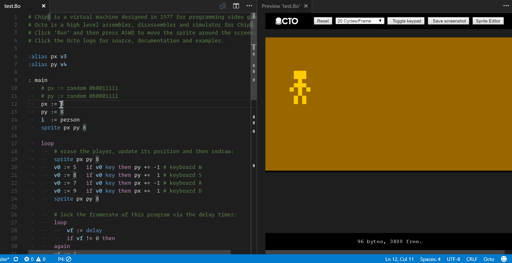
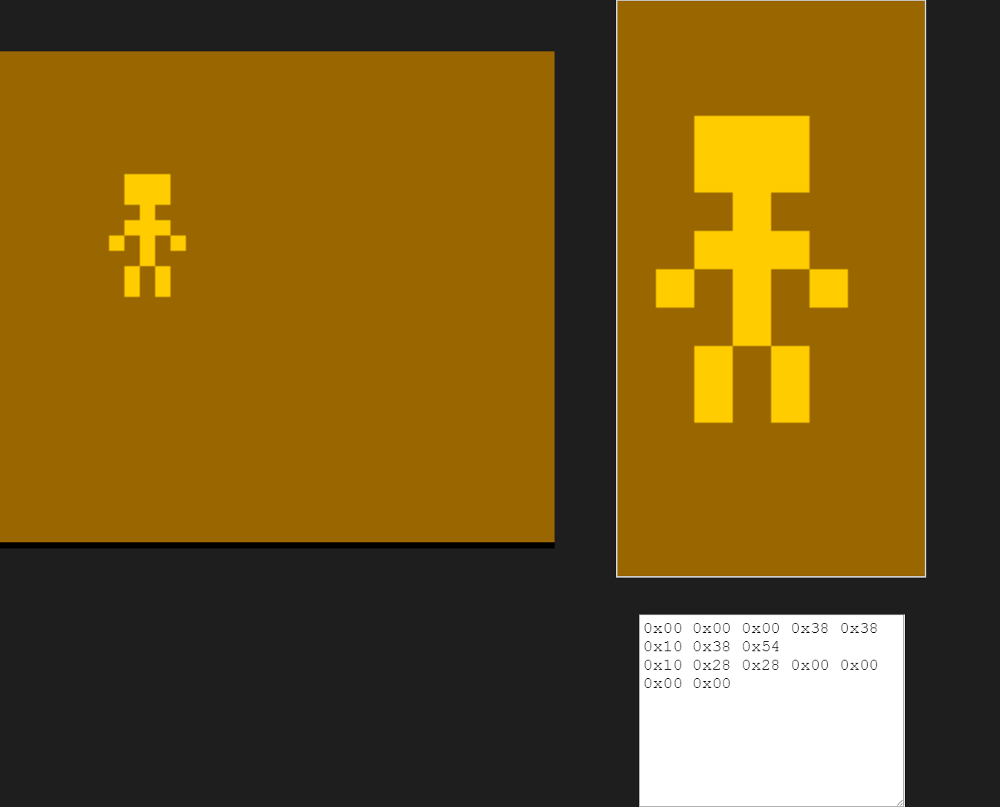
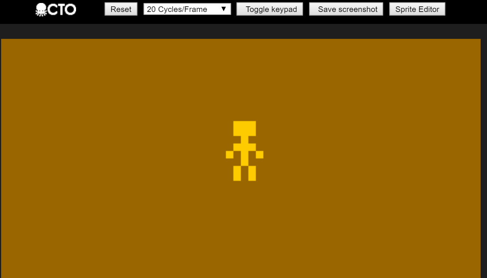

# octo-language README

This extension provides language support for the Octo language based on the [development environment](http://johnearnest.github.io/Octo/) by John Earnest.

## Overview
`Octo: Open tools` opens the main Octo development environment. It contains an emulator to preview your code, edits for sprites and audio, an on-screen hex keyboard, and tools read from and save to .ch8 files.

There are also commands to open docs and examples and to decompile ch8 hex instructions right in the editor pane. All emulator, compiler, and decompiler options are configured in user or workspace settings. More info on all of that below. 

## Features
- Syntax highlighting
- Emulator (test changes instantly)
- Debugging
- Sprite Editor
- Audio Editor
- Compile to/Decompile from .ch8 files
- Chip8, SuperChip, and XO support
- Save screenshot
- Themes + Custom coloring
- Quirk Configuration
- Open docs and examples

## Compile/Decompile
Compiling to .ch8 is as easy as opening the tools and clicking the "Export .ch8" button.  
There are two ways to decompile:
1. Paste a hex array into the vscode editor and use the `Octo: Decompile` command to decompile it. It will decompile the selection if there is one, or the whole file if there isn't one.
2. Open the tools and click the "decompile" button, import a file, and start from step 1.

## Documentation
The command `Octo: Open docs` lets you pick from several guides including beginners guides, algorithmic tutorials, and explanations of a few included examples.

## Examples
The command `Octo: Open example` lets you choose from nearly two dozen examples to open and run. These span from very basic to algorithmic demonstrations to fully-fledged games.

__NOTE:__ Until [this issue](https://github.com/Microsoft/vscode/issues/12283) is resolved, these examples are opened as editable documents, so any changes you make will clobber the example file. If you want to edit the examples I suggest copying the contents to a new file and saving. If you DO mess up and need the originals back, reinstall the extension OR find the extension directory in your vscode installation and look for the original files in `octo/examples_copy/`.

## Configuration
There are several options that can ve configured in user or workspace settings:

`octo.shiftQuirks`: <<= and >>= modify vx in place and ignore vy.  
`octo.loadStoreQuirks`: load and store operations leave i unchanged.  
`octo.vfOrderQuirks`: arithmetic results write to vf after status flag.  
`octo.clipQuirks`: clip sprites at screen edges instead of wrapping.  
`octo.jumpQuirks`: 4 high bits of target address determines the offset register of jump0 instead of v0.  
`octo.enableXO`: enable XO-Chip extended instruction set.  
`octo.tickrate`: The number of emulator cycles per rendering frame.  
`octo.screenRotation`: The degrees clockwise the screen should be rotated.  
`octo.numericFormat`: The numeric format to use when decompiling.  
`octo.numericMask`: format the numeric operand of Random n as binary.  
`octo.color.theme`: A color scheme for the emulator, pixel canvas, etc. Choose an existing theme, or choose 'Custom' and build your own.  
`octo.color.backgroundColor`: The hex value for the background color.  
`octo.color.fillColor`: The hex value for the foreground color.  
`octo.color.fillColor2`: The hex value for the second foreground color. (XO-Chip)  
`octo.color.blendColor`: The hex value for the blended color. (XO-Chip)  
`octo.color.buzzColor`: The hex value for the buzzer color.  
`octo.color.quietColor`: The hex value for the silence color.  

## Screenshots
- Test changes instantly)
  
- Sprite Editor
  
- Speed selector (cycles/frame)
  

## Known Issues
This is an early version and I may not have understood all of the features of the original development environment. Please report issues and feature requests [here](https://github.com/hoovercj/vscode-octo/issues).
- After changing a configuration setting, the .8o file must be edited before the emulator will refresh
- Sometimes an example or doc doesn't open the first time. Try opening it again.
- Related to the above, examples or docs left open when you close a workspace may fail to load when the workspace is re-opened

## Release Notes

### 0.1.0
Beta release (Should be feature complete)

### 0.0.1
Alpha/Preview release

# Acknowledgements
[John Earnest](https://github.com/JohnEarnest/) made the original project, docs, and examples. I am just adapting his code and restyling it to be responsive in a VS Code tab.