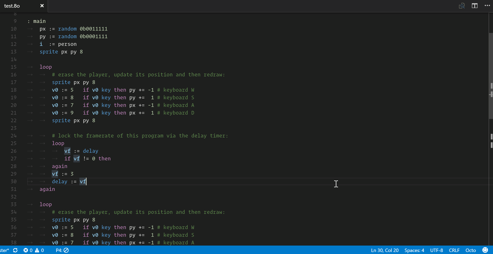

# octo-language README

This extension provides language support for the Octo language based on the [development environment](http://johnearnest.github.io/Octo/) by John Earnest.

## Documentation
The command `Octo: Open docs` lets you pick from several guides including beginners guides, algorithmic tutorials, and explanations of a few included examples.

## Examples
The command `Octo: Open example` lets you choose from nearly two dozen examples to open and run. These span from very basic to algorithmic demonstrations to fully-fledged games.

__NOTE:__ Until [this issue](https://github.com/Microsoft/vscode/issues/12283) is resolved, these examples are opened as editable documents, so any changes you make will clobber the example file. If you want to edit the examples I suggest copying the contents to a new file and saving. If you DO mess up and need the originals back, reinstall the extension OR find the extension directory in your vscode installation and look for the original files in `octo/examples_copy/`.

## Features
- Syntax highlighting
- Emulator (test changes instantly)
  
  
- Debugging
- Sprite Editor
  
- Speed selector (cycles/frame)
  

## Known Issues

This is a very early prototype and doesn't support all of the features of the full development environment.

## Release Notes

### 0.0.1
Alpha/Preview release

# Acknowledgements
[John Earnest](https://github.com/JohnEarnest/) made the original project, docs, and examples. I am just adapting his code and restyling it to be responsive in a VS Code tab.